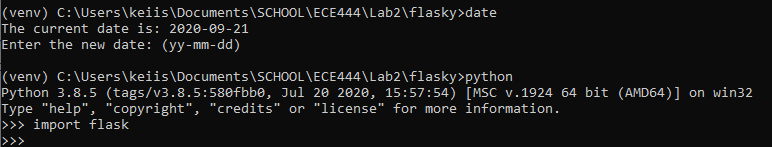
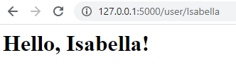

# Isabella Chen
# This repo is a clone of https://github.com/miguelgrinberg/flasky

Activity 1:

Activity 2:

Activity 3:
Flask context globals makes a variable globally accessible to a specific thread where each thread may be working a different request. They are used for when clients request some information at the same time, and when such information needs to individual for each client.